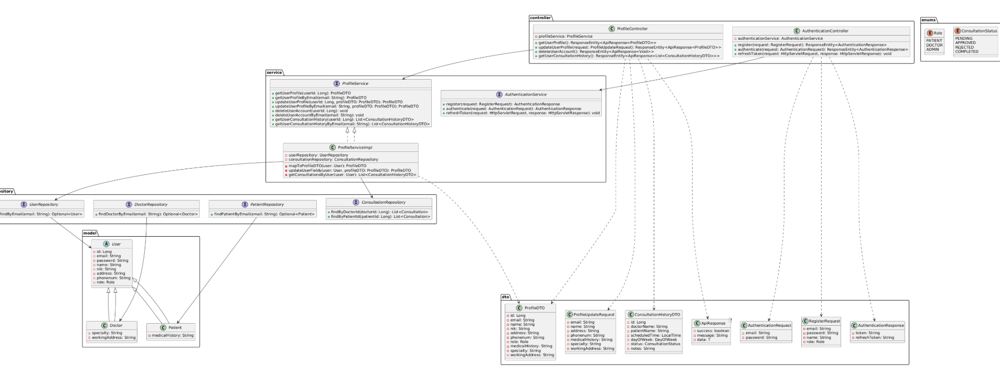
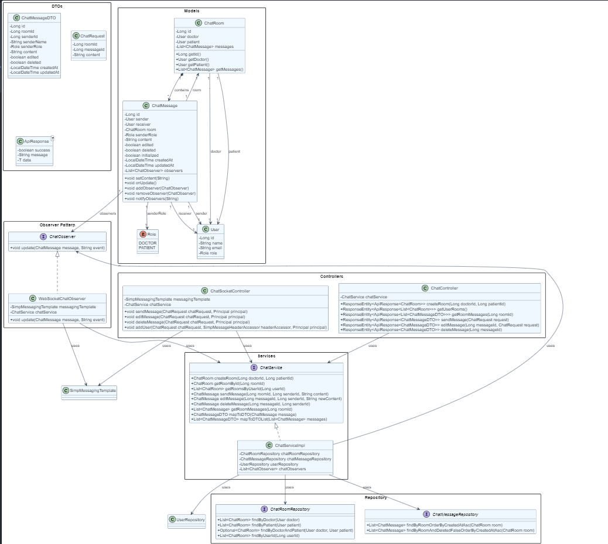
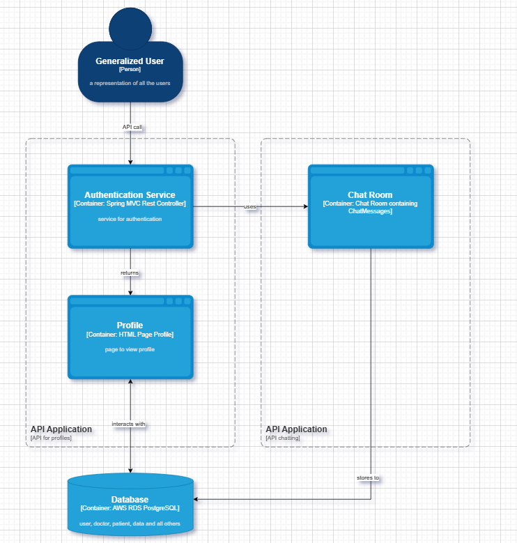

# panda-care
This is our group assignment for Advanced Programming Even 2024-2025

| Diagram Type       | Image |
|--------------------|-------|
| **Context Diagram** |  |
| **Container Diagram** |  |
| **Deployment Diagram** |  |

## After Risk Analysis

| Diagram Type         | Image |
|----------------------|-------|
| **Risk Analysis**     |  |
| **Context Diagram**   |  |
| **Container Diagram** |  |
| **Deployment Diagram**|  |

Risk Storming was applied to proactively identify and address potential threats to the PandaCare system’s architecture. This technique enabled our team to collaboratively explore critical risks—such as user data exposure, weak authentication, unsecured APIs, and system scalability bottlenecks—early in the design phase. By visually analyzing the architecture using C4 diagrams, we pinpointed vulnerable areas and introduced effective mitigations.

For example, we introduced an Authentication and Authorization container leveraging OAuth2 and JWT to secure API access and protect user data. Additionally, we enhanced scalability by integrating an Auto-Scaling Group with a Load Balancer to ensure that multiple Spring Boot instances can handle increased traffic reliably. This structured risk-focused approach ensures our system is not only functional, but also secure, resilient, and scalable from the ground up.

## Individual
### Izzy
| Diagram Type         | Image |
|----------------------|-------|
| **Code Diagram Authentication**     |  |
| **Code Diagram Schedule**   | |
| **Code Diagram Consultation** | |
| **Component Diagram**| |

### Diyo
| Diagram Type         | Image |
|----------------------|-------|
| **Code Diagram Doctor**     | |
| **Component Diagram**| |

### KD
| Diagram Type         | Image |
|----------------------|-------|
| **Code Diagram Profile** |    |
| **Code Diagram Chat**     |    |
| **Component Diagram**|   |